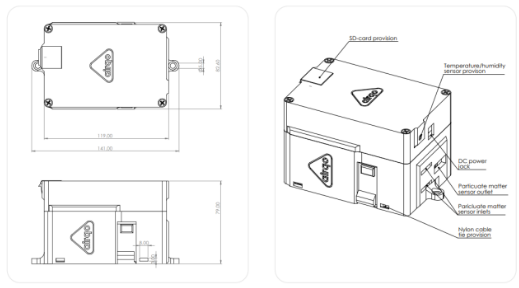
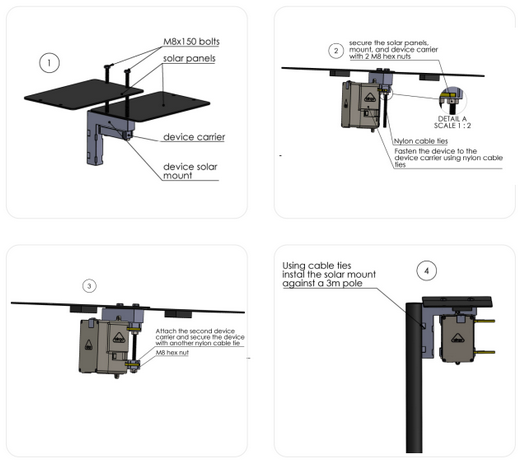

The **AirQo Outdoor monitor** is also known as the **Binos Outdoor Air monitor**.

# Know your Monitor

The AirQo Outdoor Air Monitor is a low-cost air quality monitor that measures
Particulate Matter PM2.5 and PM10, as well as ambient meteorological conditions
such as humidity and atmospheric pressure. The monitor is locally built and uniquely
designed to withstand environmental and physical conditions such as dust and
extreme weather. Powered by either mains or solar, the monitor is optimised to work
in settings characterised by unreliable power. It runs on a 2G GSM network
configuration for IoT simards.

## Technical Specifications

### Physical qualities

|            |                                      |
| :--------- | -----------------------------------: |
| Dimensions | 41.00 x 82.60 x 79.00 mm (L x W x H) |
| Weight     |                                 500g |

### Air quality measurements

|                                                    |                                                               |
| :------------------------------------------------- | ------------------------------------------------------------: |
| Particulate matter                                 | Range of measurement 0.3~1.0;1.0~2.5;2.5~10 in Micrometer(μm) |
| Effective range for PM<small>2.5</small>           |                                                   0~500 μg/m3 |
| Maximum range for PM<small>2.5</small>             |                                                    ≥1000μg/m3 |
| Maximum consistency error for PM<small>2.5</small> |                        ±10%@100~500μg/m3, ±10μg/m3@0~100μg/m3 |
| Standard volume                                    |                                                           01l |

### Other measured parameters

|                      |               |
| :------------------- | ------------: |
| Single response time |           <1s |
| Data resolution      | 60-90 seconds |

### Other measured parameters

|                      |                                                                               |
| :------------------- | ----------------------------------------------------------------------------: |
| PM<small>10</small>  |                                                                   0-500 μg/m3 |
| GPS                  |                       Sensitivity: up to -161dB, Horizontal accuracy +/- 2.5m |
| Temperature          |                            Internal and external temperature (monitor health) |
| Relative humidity    | Range 0-99%m, Response time 1s, +/-, Accuracy tolerance: ±3 % Hysteresis: ±1% |
| Atmospheric pressure |                                             30 - 110 kPa, Accuracy: ±1.5 Pa/K |

### Communication

|                          |                                                                                           |
| :----------------------- | ----------------------------------------------------------------------------------------: |
| Technology and frequency | Quad-band GSM/GPRS. 2G, Frequencies: GSM 850MHz, EGSM 900MHz, DCS 1800MHz and PCS 1900MHz |
| Data accessibility       |                                                     AirQo dashboard, AirQo API, AirQo App |

### Power supply & battery

|               |                                                                                                                               |
| :------------ | ----------------------------------------------------------------------------------------------------------------------------: |
| Input Voltage |                                                                                                                         5-12V |
| Battery       |                                                                                              3.7 V LiPo 3.5AH / Li-ion 8.8 AH |
| Power         |                                                                                             1.1W normal use, 0.098W Save mode |
| Current Draw  |                                                                     220 mA Normal use, .19.6mA Save mode, 300 mA Transmission |
| Solar         | 6W (Maximum Power), 1.2 A (Operating Current), 5V (Operating Voltage), 1.15A(Open Circuit current), 6V (Open Circuit Voltage) |
| Charge Time   |                                                                                                           90 minutes @5v, 2A. |

### Operating conditions

|                       |                                                          |
| :-------------------- | -------------------------------------------------------: |
| Deployment setting    |                               Outdoor/ambient conditions |
| Operating temperature |                                                  0-45 oC |
| Safety                | Not compatible with fire, flames, and immersion in water |

## 1.2 Monitor Package contents

- 1X AirQo Gen5 outdoor monitor
- 2X Solar Panels with mounting parts
- 1X Mounting pole
- 2X Monitor carriers
- 1X AirQo Gen5 5v 2A Power Adapter
- Screws, Wall Anchors and Cable-ties
- 1X Operation and Installation Manual
- 1X Data Accessibility Guide (optional)

# Installation Guide

package tool kit provided as part of the full product. As part of the product
This section offers user-friendly guidance on monitor installation making use of the
packaging, you are provided with mounting equipment to support pole, wall, or face
mounting. Before installation, take note of the following pre-installation precautions.

## Precautions and Guides

- Install the monitor in a location with free air circulation.
- Avoid surface installation to protect the sensor from dust particles collecting on
  the surface. This affects the quality of the sensor readings.
- Avoid installing the monitor next to a pollution source such as an active waste
  incineration facility, active smoke sources, and sinks such as under trees and
  vegetation.
- Install the monitor vertically with sensor vents facing downwards.
- Mount the monitor at normal human breathing height (about 1.5-2m above the
  ground)

### Scoping Considerations

Air quality monitoring location selection often requires several site scoping
considerations to be undertaken. These include;

| Considerations                                | Description                                                                                                                                                                                                |
| :-------------------------------------------- | :--------------------------------------------------------------------------------------------------------------------------------------------------------------------------------------------------------- |
| Local needs assessment                        | Planning, environmental priorities                                                                                                                                                                         |
| Population distribution and density           | To ensure monitoring exposure assessment & other epidemiological studies can be carried out and large number of people have access to air quality data                                                     |
| Location and nature of pollution sources      | Proximity to pollutions sources is vital in case one of the objective of monitoring is understanding the emission contributors e.g nature of economic activities, transportation setup & volume of traffic |
| Land-use characteristics                      | Critical for understanding the air quality variations across the various land-use patterns, Commercial, background, residential, Industrial, slums,reserved areas, etc.                                    |
| Terrain and Landforms                         | The nature of topography, terrain and landforms should be considered i.e. hill, mountain, vallies, green spaces, water bodies etc                                                                          |
| Legal framework and monitoring infrastructure | Number of existing air quality monitors in the city/area, Types pollutants measured/monitored, Existing legal framework                                                                                    |
| Weather and climate                           | Wind direction & speed, Temperature, rainfall, humidity levels                                                                                                                                             |

### Installation site guidelines

The process of finding an appropriate place to site and install the AirQo outdoor air
quality monitor is equally important. Indeed, the site where a sensor is placed can
impact the usefulness of the data. The table below briefly outlines some key logistical
considerations and recommendations to help with determining where to place the
sensor.

| Considerations                  | Breakdown                                                                                                                                                                                                                                                                        |
| :------------------------------ | :------------------------------------------------------------------------------------------------------------------------------------------------------------------------------------------------------------------------------------------------------------------------------- |
| Security                        | Security guards/ agents, CCTV Cameras                                                                                                                                                                                                                                            |
| Power Access                    | The site should either be a backup generator if the frequency of power outages are high Power and there should be a power socket. For solar installation: the site should assure; Sunshine reliability, Can solar panels be added without being shielded?                        |
| Communication reliability       | The site of installation choice should have high signal strength for easy communication with the AirQo platform. The installation site should be away from electrical interferences such as high power lines. Also, the siteshould allow; Network connectivity of both 2G and 5G |
| Access to the location          | The site of choice should be accessible with approval from local authorities and there should be a well constructed access road to the site.                                                                                                                                     |
| Distance from pollution sinks   | The installation site should be far away from; Trees, High walls with electric fences, Storey buildings                                                                                                                                                                          |
| Distance from pollution sources | The installation site should be far away from; Waste incinerators, Fire, Barbecue grill, Compost pit, Construction, Hyperlocal sources such as roads, chimney                                                                                                                    |

### Pre-Installation precautions

- Check whether you have all the tools and equipment
- Ensure there are no physical damages to the monitor.
- Take the monitor out of the packaging
- Set up the installation location such as a pole, wall, or mount on a flat surface
- Make sure the installation location can allow at least 270-degree airflow around the monitor inlet.
- Check the battery specification to understand whether the monitor is solar, or mains powered. Bigger battery specifications are normally reserved mainly for solar-powered monitors. It is worthy to note there are no limitations in having a solar-powered monitor powered by mains. This is a chosen design option by the AirQo team to

## Installation setup procedure

## Post-installation of the monitor

### Powering the monitor

- Powering the monitor
- Plug the provided power adapter into a socket and power cord into the monitor. If using a plug other than that provided by AirQo, make sure the plug specifications are 5V, 2A
- The monitor should beep twice to indicate power-up and battery charging
- Deeping on the number of beeps, the status of the monitor can be known as summarised in the table below

**Monitor alarms are summarised in the table below**

| Alarms               | Alarm Tones                    | Tone Details  | Duration   |
| :------------------- | :----------------------------- | :------------ | :--------- |
| Power on             | One beep                       | High          | 0.5 second |
| Transmission failure | One beep                       | Low           | 0.5 second |
| Low battery          | Two beeps (repeated 8 seconds) | Low High      | 1 second   |
| Monitor restart      | Three beeps                    | High Low High | 1.5 second |

### Maintenance

To ensure safety of the system, maintenance should never be performed when the
monitor is powered or connected to the power adapter. The AirQo monitor contains
very sensitive sensors that damage when exposed to electro-static discharge and
extra precautions should be observed to protect sensors susceptible to electro-static
discharge.

**Basic maintenance toolkit**

Essential tools: Simple dust blowing mechanism
Optional tools: spare sensors

**Troubleshooting**

(i) Monitor not transmitting data at all

| Issue         | Identification of the issue                                                             | Solution                                                                                                                                                                                 |
| :------------ | :-------------------------------------------------------------------------------------- | :--------------------------------------------------------------------------------------------------------------------------------------------------------------------------------------- |
| Power Issue   | Check whether the monitor is plugged, Check the solar panels                            | Check whether the cable from the panels is clearly plugged in the monitor. Plug the monitor if unplugged, Clean the solar panels using soft cloth or squeegee to clean the upper surface |
| Communication | Sim-card out of data, Sim-card non functional/ cut off by the provider, GSM malfunction | Load data if local sim-card used, Reach out to AirQo, Listen to the sound made by the monitor to know whether it is a GSM issue                                                          |
| Sensor Issue  | No data being reported by the sensors ( PM levels = 0.0)                                | Replace the sensors                                                                                                                                                                      |

(ii) Incorrect/inconsistent data
| Issue | Identification of the issue |Solution|
| :----------- | :----------- |:---------- |
| Communication | Monitor taking long to post (possible cause is low battery and the monitor will be making bulk updates) | Leave the monitor to fully charge and re-evaluate |
|Sensor Issue | Low intra sensor correlation (< 0.98), Sensor reporting low or higher data than expected | Replacing the sensors, Blowing dust off the sensor inlets |

**Guide to maintaining the AirQo Monitor**
**Power issues**

- Use a soft cloth or squeegee to clean the upper surface of the solar panel
- Check whether the cable from the panels is clearly plugged in the monitor.
- Replace the batteries if issue is not resolved

**Replacing the Sensors and battery**

# Data Access

## 4.1 Joining the AirQo platform

To set up an account on the AirQo platform, follow this link: https://platform.airqo.net.
You will be presented with a dashboard like pictured below.

Air quality monitoring location selection often requires several site scoping
considerations to be undertaken. These include;

After filing in the required details, click REQUEST to register. Upon registration, you
will receive an email as illustrated below with access requested and received
confirmation.

After approval by the AirQo, you will receive a followup email on the next steps which
include access details with temporary password and illustration on how to set a new
password to your net-manager account.

## 1.1 Platform Features

**The Dashboard**
The dashboard feature allows you to develop graphical representations of datasets
from your monitors. This feature enables you to select and display different types of
graphs for a specific region and monitor datasets. The Live AQI section indicates the
distribution of the status of air pollution reported based on the AQI index. The mean
daily PM<small>2.5</small> and exceedance graphs display the mean daily particulate matter
concentration and how much these readings are above the WHO recommended
pollution levels respectively. The other sections can be customised to display only
selected networks or monitors.

**Visualisation**
To set up an account on the AirQo platform, follow this link: [https://platform.airqo.net](https://platform.airqo.net).
You will be presented with a dashboard like pictured below.

**Data Export**
To set up an account on the AirQo platform, follow this link: https://platform.airqo.net.
You will be presented with a dashboard like pictured below.

### 3.1.1 Testing on the device

Log into AirQo net-manager
Check the device map to see whether the device is connected.

**Congratulations, you can now access your air quality data on the AirQo app,
website and API!**

### 3.2 Data Access through the AirQo API

In addition to the existence of the platform, data access is also available via the AirQo
API. To utilise the AirQo API for data access, please review the documentation
accessed via this link: [https://docs.airqo.net/airqo-rest-api-documentation/](https://docs.airqo.net/airqo-rest-api-documentation/)

**Map**
Map shows the air quality status and distribution of AirQo devices and other affiliated
devices across the world. To check if your device is working and is registered on the
platform for data access and visualisation, log into AirQo net-manager and check if
the device appears on the Map to see whether the device is connected.

