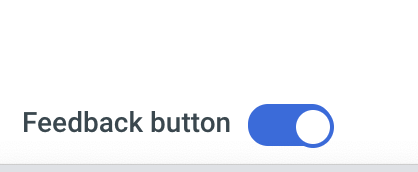
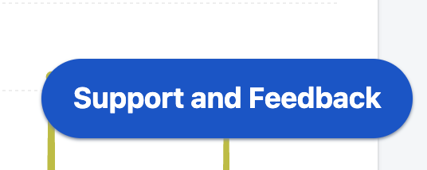
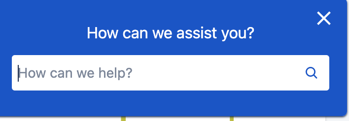
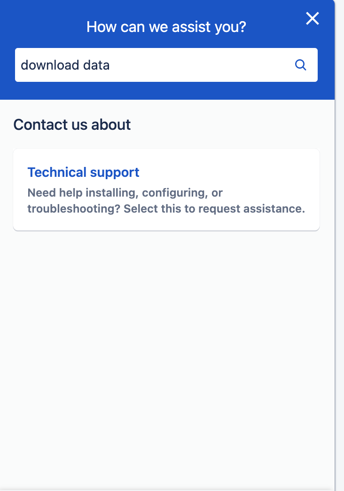
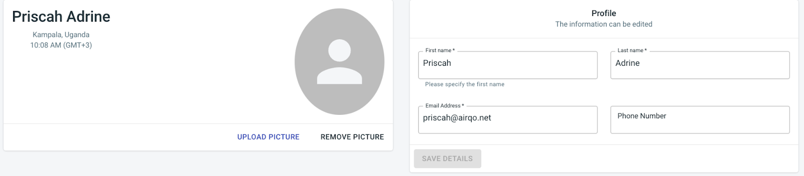

# Extras

# Support and feedback

On the left-hand side at the bottom enable the feedback button to enable the support and feedback button

You will then see a support and feedback button on the lower right-hand side. You can use the button to get in touch if you are having challenges accessing the data.

|  |
| :--------------------------------------------: |
|         <b>Enable feedback button</b>          |

|  |
| :--------------------------------------------: |
|         <b>Access feedback button</b>          |

# User management

## Account Settings

By clicking the account button on the left-hand side, you can make changes to your profile by choosing to upload your picture, add your phone number or change your name and email address.

## Settings

You can manage your account and change your password by clicking the settings button on the left-hand side.

## Add user

If you are an organisation account's admin, you will be able to access USERS data allowing you to add or remove users to the site

