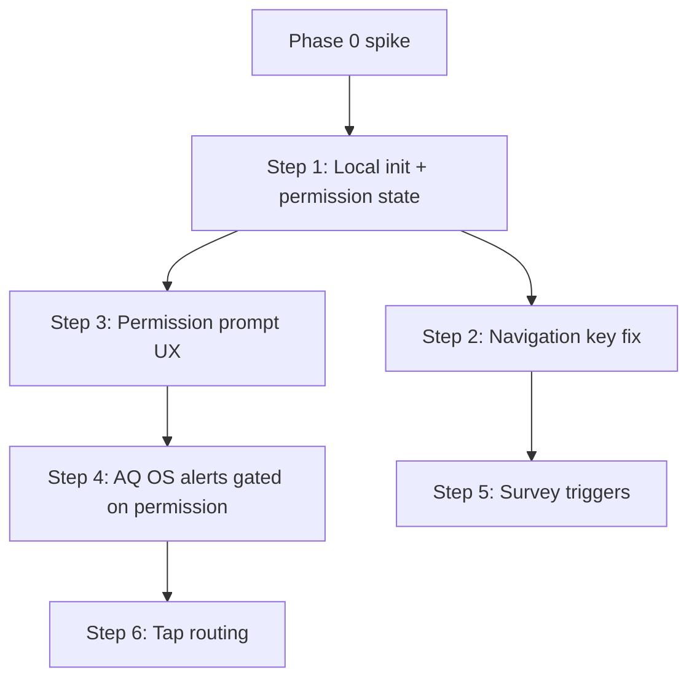

# Mobile Notification Scaffold — Inventory & Plan

## Why this document exists

We audited the existing notification code in the mobile app. **Most of the notification product is already built but not connected.** This doc records what exists, what actually works today, and the recommended path forward — starting with **local, device-driven notifications** before investing in server push (FCM).

**This document is the guardrail for Phase 1 implementation.** Sequencing, dependencies, test matrix, and cooldown rules below are requirements, not suggestions.

---

## Current state (executive summary)

| Status | Count | Detail |
|--------|-------|--------|
| **Working today** | 1 | My Places success/error toasts (#6) |
| **Built but not wired** | 5 | Local notifications (#1–#5) |
| **Built but deferred** | 4 | Server push via FCM (#7–#10) |
| **Separate (not OS notifications)** | 1 | Learn tab survey badge (UI only) |

**Bottom line for PM:** We are not starting from zero. We have scaffold code for air quality alerts and survey prompts — the work is **wiring and testing**, not building from scratch. Server push (Firebase) can wait.

---

## How notifications are categorised

**Local OS** — appears in the phone notification shade (`flutter_local_notifications`).

**Local in-app** — overlay, banner, or dialog while the app is open.

**FCM** — message sent from our backend via Firebase (Android + iOS). Requires Firebase setup and backend integration.

> None of the scaffold notifications are **scheduled background jobs** yet. Local ones fire when the app runs relevant code; FCM ones fire when the server sends a push.

---

## Inventory — what exists in the scaffold

### Local (device-driven)

| # | Notification | Where it shows | Wired? | Code |
|---|--------------|----------------|--------|------|
| 1 | **Nearby air quality alert** | Local OS (shade) | No | ```372:377:src/mobile/lib/src/app/shared/services/notification_helper.dart``` |
| 2 | **Survey prompt (modal)** | Local in-app (dialog) | No | Trigger: ```289:289:src/mobile/lib/src/app/surveys/services/survey_trigger_service.dart``` → UI: ```83:94:src/mobile/lib/src/app/shared/services/notification_manager.dart``` |
| 3 | **Air quality alert banner** (from survey AQ trigger) | Local in-app (top banner) | No | Trigger: ```393:425:src/mobile/lib/src/app/surveys/services/survey_trigger_service.dart``` → UI: ```244:257:src/mobile/lib/src/app/shared/services/notification_manager.dart``` |
| 4 | **Survey banner** (tap-to-open) | Local in-app (top banner) | No (dead code) | ```492:502:src/mobile/lib/src/app/shared/services/notification_manager.dart``` |
| 5 | **Permission prompt** (“Enable notifications…”) | Local in-app (bottom toast) | No | ```48:73:src/mobile/lib/src/app/shared/services/notification_manager.dart``` called from ```30:50:src/mobile/lib/src/app/shared/services/notification_helper.dart``` |
| 6 | **Status toast** (success/error) | Local in-app (bottom toast) | **Yes** (My Places only) | UI: ```16:44:src/mobile/lib/src/app/shared/services/notification_manager.dart``` → caller: ```227:227:src/mobile/lib/src/app/dashboard/widgets/my_places_view.dart``` |

### FCM (server-driven) — deferred for now

| # | Notification | Where it shows | Wired? | Code |
|---|--------------|----------------|--------|------|
| 7 | **FCM → local OS mirror** (any push while app is open) | Local OS (shade) | No | ```273:284:src/mobile/lib/src/app/shared/services/push_notification_service.dart``` |
| 8 | **`air_quality_alert` push** | Local in-app (top banner) | No | Route: ```74:75:src/mobile/lib/src/app/shared/services/notification_helper.dart``` → UI: ```114:123:src/mobile/lib/src/app/shared/services/notification_helper.dart``` |
| 9 | **`survey` push** | Local in-app (simple toast) | No | ```127:141:src/mobile/lib/src/app/shared/services/notification_helper.dart``` |
| 10 | **`general` push** | Local in-app (simple toast) | No | ```148:158:src/mobile/lib/src/app/shared/services/notification_helper.dart``` |

FCM routing entry point (all three push types above):

```73:84:src/mobile/lib/src/app/shared/services/notification_helper.dart
    switch (type) {
      case 'air_quality_alert':
        _showAirQualityNotification(context, message);
        break;
      case 'survey':
        _showSurveyNotification(context, message);
        break;
      case 'general':
      default:
        _showGeneralNotification(context, message);
        break;
    }
```

### Not in this scaffold

- **Learn tab survey badge** — UI badge only, not an OS or push notification (`SurveyNotificationService` + `NavPage`).

---

## Key decision: local-first, defer FCM

The scaffold bundles **local notifications** and **Firebase push (FCM)** in one service. They serve different needs:

| Approach | Who decides to notify | Example | Needed now? |
|----------|----------------------|---------|-------------|
| **Local** | The app on the user's device | “Air near you is Unhealthy” when dashboard loads | **Yes** |
| **FCM (push)** | Our server | City-wide alert broadcast to all users | **No** (later) |

**Recommendation:** Wire up **#1–#5** first. Leave **#7–#10** uninitialised until product requires server-initiated alerts (e.g. admin broadcasts, campaigns). This avoids Firebase setup, backend token storage, and duplicate logic while we validate the core user experience.

---

## Implementation guardrails (PM feedback — must follow)

These rules govern Phase 1. Do not pick up steps out of order or in parallel where dependencies exist.

### Guardrail 1 — Permission before OS alerts

**Do not dispatch OS alerts (#1) until notification permission state is known.**

- On **iOS**, an alert fired before permission is granted is **silently dropped**.
- On **Android 13+**, firing without `POST_NOTIFICATIONS` granted may no-op or error depending on guards.

**Required behaviour:**
1. Initialise local notifications and resolve permission state **before** wiring dashboard AQ checks.
2. Show the permission prompt (#5) at an appropriate moment **before** the first OS alert attempt.
3. **Gate** `checkNearbyAirQuality()` → `showLocalNotification()` behind `hasPermission() == true`. If denied, skip OS alert (optionally show in-app prompt only).

### Guardrail 2 — Navigation fix before survey triggers

**Step “Survey triggers” is blocked until navigation key is fixed.**

Survey triggers (#2, #3) call `NavigationService.showSurveyNotification()`. If `canNavigate` is false (separate `navigatorKey` in `NavigationService` vs `main.dart`), triggers fire but **no dialog appears** — a silent failure that is easy to miss in QA.

**Required behaviour:**
- Fix shared `navigatorKey` **before** starting `SurveyTriggerService` with live data.
- Do **not** assign survey trigger wiring to a different engineer in parallel with navigation fix unless Step 2 is already merged.

### Guardrail 3 — Spike before full sprint commitment

Steps 1–2 (local init + permissions + navigation) touch **iOS and Android permission models separately** (Android 13+ runtime permission is a known risk area).

**Required behaviour:**
- **Timebox a 1–2 day spike** on Steps 1–2 only.
- Re-estimate Steps 3–6 after the spike surfaces OS-version-specific issues.
- Do **not** commit to “~1 sprint for all of Phase 1” until spike sign-off.

### Guardrail 4 — Concrete test matrix before Phase 1 sign-off

“Works on Android 13+ and iOS” is not sufficient for sign-off. Phase 1 is **not done** until the matrix below is executed and results recorded.

| Platform | Version | Device / emulator | Must test |
|----------|---------|-------------------|-----------|
| Android | 13 (API 33) | Physical or emulator | Runtime permission prompt; OS alert after grant; no alert / no crash when denied |
| Android | 14+ (API 34+) | Physical or emulator | Same as above |
| iOS | 16 | Simulator or device | Permission prompt; OS alert after grant; silent skip when denied |
| iOS | 17+ | Simulator or device | Same as above |

**Additional scenarios (all platforms):**
- Permission granted → AQ OS alert fires when Unhealthy+ near user
- Permission denied → no OS alert; app remains stable
- AQ cooldown: second alert suppressed within 6 hours
- Survey trigger fires → in-app dialog visible and actionable
- Survey cooldown: same survey not re-triggered within 6 hours
- Tap OS AQ alert → app opens to expected screen (Step 6)
- My Places toasts (#6) still work (regression)

### Guardrail 5 — Cooldowns are independent (do not share state)

Phase 1 activates two trigger surfaces. Their cooldowns **must remain separate**.

| Surface | Storage | Scope | Duration | Code |
|---------|---------|-------|----------|------|
| **AQ OS alerts (#1)** | Hive cache key `aq_alert_cooldown` | **Global** — one cooldown for all AQ OS alerts | 6 hours | ```313:384:src/mobile/lib/src/app/shared/services/notification_helper.dart``` |
| **Survey triggers (#2, #3)** | SharedPreferences `survey_trigger_history` | **Per survey ID** — each survey has its own last-triggered timestamp | 6 hours per survey | ```33:99:src/mobile/lib/src/app/surveys/services/survey_trigger_service.dart``` |

**Required behaviour:**
- Do **not** merge AQ and survey cooldown into a single shared key.
- AQ alert cooldown suppresses **OS shade alerts only**; it does not block survey in-app dialogs.
- Survey cooldown suppresses **that survey’s** re-trigger; it does not block AQ OS alerts.
- If product later wants a global “max N notifications per day” cap, that is a **new** rule — out of Phase 1 scope.

---

## Recommended plan

### Phase 0 — Spike (timebox: 1–2 days)

**Goal:** De-risk permissions and navigation before committing to full Phase 1 estimate.

| Step | What | Exit criteria |
|------|------|---------------|
| 0a | Initialise local notifications (local-only path; no FCM) | Plugin initialises without error on Android + iOS |
| 0b | Request/check notification permission on both platforms | Permission granted/denied/permanently-denied paths documented |
| 0c | Unify `navigatorKey` (`main.dart` ↔ `NavigationService`) | `NavigationService.canNavigate == true` when app is on dashboard |
| 0d | Re-estimate Steps 1–6 | Updated day breakdown agreed before full implementation |

**Spike sign-off required before starting Phase 1 proper.**

---

### Phase 1 — Wire existing local scaffold

Connect code that is already written. No new notification types — just make the scaffold work.

**Steps must be executed in this order.** Dependencies are explicit.

| Step | What | Maps to | Depends on | User-facing outcome |
|------|------|---------|------------|---------------------|
| **1** | Initialise local notifications + resolve OS permission state | Foundation for #1, #5 | Phase 0 spike | App knows whether it may show OS notifications |
| **2** | Fix navigation key so in-app dialogs can open | Foundation for #2, #3 | Step 1 | Survey prompts can render (not silent failure) |
| **3** | Show permission prompt (#5) at the right moment | **#5** | Step 1 | User is asked once to enable notifications before first OS alert |
| **4** | Hook nearby AQ check to dashboard / app resume — **gated on permission** | **#1** | Steps 1, 3 | User gets OS alert when air near them is Unhealthy+ **and** permission granted |
| **5** | Start survey trigger service with live data | **#2**, **#3** | **Step 2** (hard dependency) | User gets in-app survey prompt based on location, time, or AQ |
| **6** | Add tap routing on OS alerts | **#1** (enhancement) | Step 4 | Tapping an AQ alert opens the app to the relevant screen |



**Phase 1 success criteria (all required for sign-off):**
- User receives an **OS notification** when air quality near their location is Unhealthy or worse — **only when permission is granted** (6-hour AQ cooldown applies).
- User sees an **in-app survey dialog** when trigger conditions are met (6-hour per-survey cooldown applies).
- Permission flow works on Android 13+ and iOS per **test matrix above**.
- My Places toasts (#6) continue to work as today.
- Test matrix completed and results recorded.

### Phase 2 — Clean up & decide (after Phase 1 validates UX)

| Item | Question for PM | Options |
|------|-----------------|---------|
| **#4 Survey banner** | Do we want a top banner *in addition to* the survey modal? | Wire it, or remove as duplicate |
| **#7–#10 FCM** | Do we need server-sent alerts this quarter? | Keep dormant, or plan a separate push initiative |
| **Notification settings** | Should users control alert types? | Add settings screen once local alerts are live |

### Phase 3 — True background & advanced (future)

Not in the current scaffold. Requires separate scoping:

- Alerts when the app is fully closed (needs push or background tasks)
- Scheduled reminders (daily digest, learn nudges)
- Quiet hours and per-category preferences

---

## What we are explicitly not doing in Phase 1

- Firebase / FCM setup and token registration
- Backend push integration
- Notification preferences screen
- Deleting FCM code (leave it dormant until team agrees on push scope)
- Merging AQ and survey cooldown state
- Dispatching OS alerts before permission state is resolved

---

## Suggested schedule (post-spike)

Estimate is **TBD until Phase 0 spike completes.** Indicative breakdown after spike sign-off:

| Block | Engineering focus | Guardrail |
|-------|-------------------|-----------|
| Phase 0 (1–2 days) | Local init, permissions, navigation key | Spike sign-off before continuing |
| Block A | Steps 1–3: permission foundation + prompt UX | No OS alerts until Step 3 done |
| Block B | Step 4: AQ OS alerts (permission-gated) | Gate on `hasPermission()` |
| Block C | Step 5: Survey triggers | **Blocked until Step 2 merged** |
| Block D | Step 6 + full test matrix | Sign-off requires matrix pass |

---

## Train of thought (summary for PM)

1. **Audited the codebase** → found 10 notification touchpoints; only 1 works today.
2. **Separated local vs push** → most value is in local alerts we can ship without backend work.
3. **Prioritised wiring over building** → #1–#5 already exist; Phase 1 is connection and QA.
4. **Deferred FCM** → #7–#10 stay off until we need server-driven broadcasts.
5. **Incorporated PM feedback** → permission before OS alerts, explicit Step 2 → Step 5 dependency, spike before full estimate, concrete test matrix, independent cooldowns documented.
6. **Defined clear success** → user gets AQ OS alerts (when permitted) and contextual survey prompts; test matrix passed; then iterate on settings and push.

---

## Inventory totals

**6 local** (1 OS + 5 in-app) · **4 FCM** (1 OS mirror + 3 in-app handlers) · **1 working today** (#6)

**Phase 1 focus:** #1–#5 · **Deferred:** #7–#10
